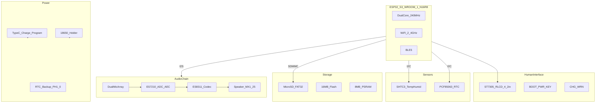
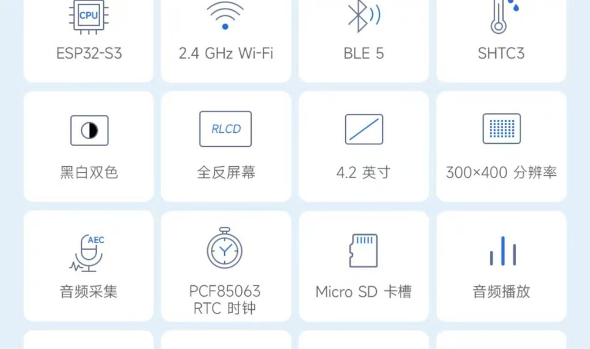
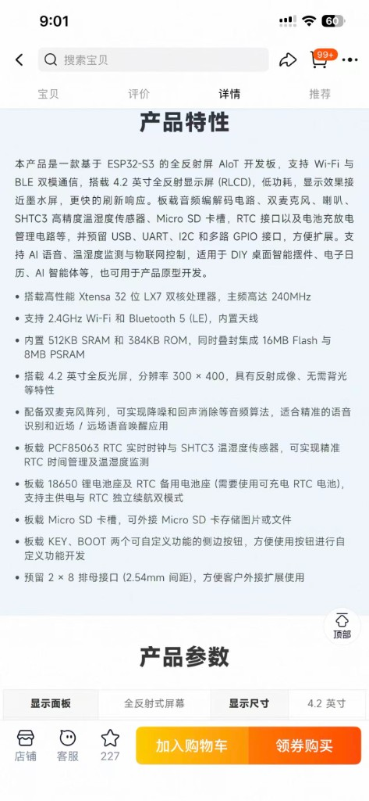
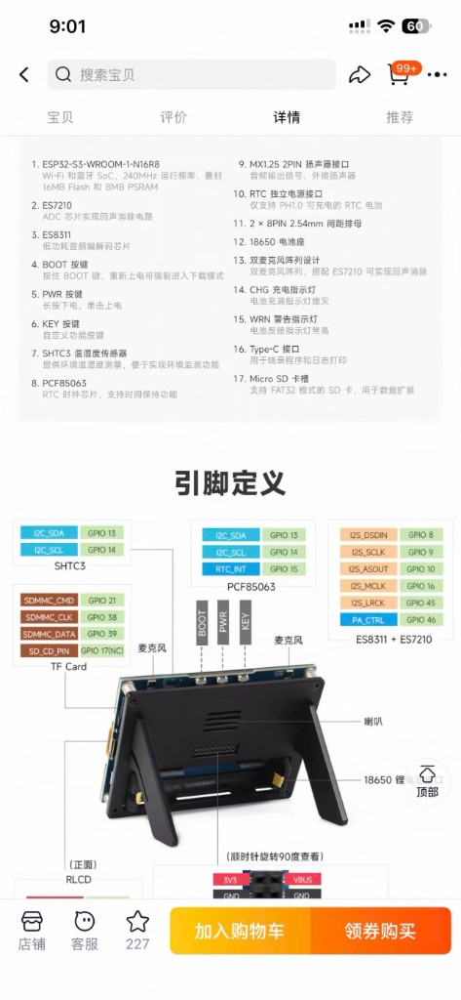

# Waveshare ESP32-S3-RLCD-4.2 — 技术文档

| 项目 | 说明 |
|------|------|
| 文档版本 | v1.1 |
| 更新日期 | 2026-05-22 |
| 官方型号 | **ESP32-S3-RLCD-4.2**（微雪 Waveshare） |
| SKU | 33298（含 18650 电池）/ 33507（不含电池） |
| 官方 Wiki | [docs.waveshare.com/ESP32-S3-RLCD-4.2](https://docs.waveshare.com/ESP32-S3-RLCD-4.2) |
| 示例仓库 | [github.com/waveshareteam/ESP32-S3-RLCD-4.2](https://github.com/waveshareteam/ESP32-S3-RLCD-4.2) |
| 资料来源 | 官方 Wiki、GitHub 示例、`board_cfg.txt`、原理图（见 [§9](#9-附录)） |

---

## 1. 产品概述

### 1.1 定位

**Waveshare ESP32-S3-RLCD-4.2** 以 **ESP32-S3** 为核心，集成 **4.2 英寸反射式 LCD（RLCD，驱动 IC ST7305）**、**双麦克风语音采集（含回声消除）**、**音频播放**、**温湿度传感**、**实时时钟**、**Micro SD 扩展** 与 **18650 便携供电**，面向低功耗常显、语音交互与环境感知类 **AIoT** 原型开发。支持 **ESP-IDF** 与 **Arduino IDE** 两套框架。

### 1.2 核心能力

- **4.2" RLCD（300×400，黑白）**：反射式成像、无背光，阳光下可读；刷新较电子纸更快，适合常显信息类 UI
- **双麦 + AEC 音频链路**：ES7210（ADC/AEC）+ ES8311（编解码），支持降噪与回声消除，适合语音唤醒与识别
- **环境感知与时间**：SHTC3 温湿度 + PCF85063 RTC（可独立备电）
- **便携供电**：18650 电池座 + Type-C 充放电管理
- **联网**：2.4GHz Wi-Fi + Bluetooth 5 LE

### 1.3 系统框图



---

## 2. 技术规格

> 以下参数整理自 [Waveshare 官方 Wiki](https://docs.waveshare.com/ESP32-S3-RLCD-4.2)，最终以实物为准。

| 类别 | 参数 |
|------|------|
| **主控模组** | ESP32-S3-WROOM-1-N16R8 |
| **处理器** | Xtensa 32 位 LX7 双核，最高 240MHz |
| **片上内存** | 512KB SRAM，384KB ROM |
| **板载存储** | 16MB Flash，8MB PSRAM |
| **无线** | 2.4GHz Wi-Fi；Bluetooth 5（LE）；板载天线 |
| **显示屏** | 4.2 英寸 RLCD；300×400；2 阶灰度（黑白）；反射式、无背光；**SPI**；驱动 IC **ST7305** |
| **音频 ADC** | ES7210（回声消除） |
| **音频编解码** | ES8311（低功耗 Codec） |
| **麦克风** | 双麦阵列（板载） |
| **喇叭接口** | MX1.25 2Pin 外接喇叭座 |
| **温湿度** | SHTC3 |
| **实时时钟** | PCF85063；RTC 独立备电接口（PH1.0，**仅支持可充电 RTC 电池**） |
| **存储扩展** | Micro SD 卡槽（建议 FAT32） |
| **主电池** | 18650 锂电池座 |
| **充电/编程** | Type-C（烧录、串口日志、充电） |
| **扩展接口** | 2×8 2.54mm 母座；预留 USB / UART / I2C / GPIO |
| **按键** | BOOT、PWR、KEY（KEY 可自定义） |
| **指示灯** | CHG（充电，充满熄灭）；WRN（电池反接告警） |

### 2.1 显示特性说明

RLCD（Reflective LCD）通过反射环境光成像，**无需背光**，典型功耗低于传统 TFT。视觉效果接近电子纸，但**刷新速率通常更快**，更适合需要周期性刷新的时钟、天气、状态看板。暗光环境下可读性较差，设计 UI 时需考虑对比度与字号。

---

## 3. 板载资源与器件说明

### 3.1 ESP32-S3-WROOM-1-N16R8

ESP32-S3 具备双核算力、AI 向量指令加速，以及 Wi-Fi / BLE 连接能力。模组型号 **N16R8** 表示板载 **16MB Flash** 与 **8MB PSRAM**，适合运行语音前端、LVGL 帧缓冲及网络协议栈。开发时目标芯片选 `esp32s3`；官方要求 **ESP-IDF v5.5.0 及以上**（示例基于 v5.5.2）。

### 3.2 RLCD 显示屏（ST7305）

| 项目 | 参数 |
|------|------|
| 面板类型 | 全反射式 RLCD（Reflective LCD） |
| 尺寸 | 4.2 英寸 |
| 分辨率 | 300 × 400（物理）；示例工程中 LVGL 常按 **400×300** 横屏逻辑坐标使用 |
| 灰度 | 2 阶（黑 / 白） |
| 接口 | **SPI**（`SPI3_HOST`） |
| 驱动 IC | **ST7305** |

官方 `DisplayPort` 构造参数（[FactoryProgram `main.cpp`](https://github.com/waveshareteam/ESP32-S3-RLCD-4.2)）：`mosi=12, scl=11, dc=5, cs=40, rst=41`。刷新可走自研 `DisplayPort`、**LVGL v8/v9** 或 **U8G2**（官方 U8G2 示例宣称可达约 **74 FPS**，适合快刷 UI）。

> **注意**：安装 Type-C 线或 18650 电池时**勿按压屏幕**；屏幕脆弱，不当操作导致的损坏不在保修范围内（见官方 Wiki 警示说明）。

### 3.3 音频子系统（ES8311 + ES7210 + 双麦）

| 芯片 | 作用 |
|------|------|
| **ES8311** | 低功耗音频 DAC/ADC（Codec），负责播放与录音通道 |
| **ES7210** | 多路 ADC，用于**回声消除（AEC）**及多麦采集 |
| **双麦阵列** | 提升拾音指向性，配合降噪/AEC，适合近场/远场唤醒 |

官方 `board_cfg.txt` 板型名 **`S3_RLCD_4_2`**，I2C 地址：**ES8311 = 0x18**，**ES7210 = 0x40**。功放使能 **PA = GPIO46**。采样率示例为 **16 kHz / 16 bit / 双声道**。喇叭通过 **MX1.25 2Pin** 外接。语音类应用可结合 [ESP-Skainet](https://github.com/espressif/esp-skainet) 做唤醒词；识别可本地或对接云端 ASR。

### 3.4 SHTC3 温湿度传感器

Sensirion 数字温湿度传感器，精度较高，适合环境监测、农业/家居 IoT。与 RTC 共用 I2C 总线（见 [§4](#4-接口与引脚定义)）。

### 3.5 PCF85063 实时时钟

低功耗 RTC，用于断电后仍保持计时（需 RTC 备电电池）。官方示例 I2C 地址 **0x51**。提供 **RTC_INT（GPIO15）** 中断引脚，可用于定时唤醒、闹钟提醒等。与 SHTC3 共用 **GPIO13/14** I2C（`I2cMasterBus(14, 13, 0)`，即 SCL=14、SDA=13）。

### 3.6 Micro SD 卡槽

采用 **SDMMC** 模式，引脚已固定。卡检测脚 **SD_CD（GPIO17）** 标注为 **NC（未连接）**，软件侧可能无法检测热插拔，开发时建议启动时挂载或避免带电插拔。

### 3.7 电源与电池管理

- **18650 座**：便携供电；建议使用带保护板的合格电芯
- **Type-C**：充电、固件烧录、USB 串口日志
- **PWR 键**：单击开机，长按关机
- **CHG 灯**：充电时常亮，充满熄灭
- **WRN 灯**：18650 **反接**时点亮，安装电池前务必确认正负极
- **RTC 备电**：PH1.0 接口，**必须使用可充电 RTC 电池**（商品原文要求，不可使用一次性纽扣电池替代方案除非卖家明确允许）

---

## 4. 接口与引脚定义

以下 GPIO 映射综合自 [官方 Wiki 接口图](https://docs.waveshare.com/ESP32-S3-RLCD-4.2)、[GitHub `board_cfg.txt`](https://github.com/waveshareteam/ESP32-S3-RLCD-4.2) 与示例工程，建议在工程中集中于 `components/board/include/board_pins.h` 统一管理。

### 4.0 GPIO 总览

| GPIO | 功能 | 备注 |
|------|------|------|
| GPIO0 | BOOT 按键 | 低电平有效；按住上电进下载模式 |
| GPIO4 | 电池电压 ADC | ADC1 通道 3（`03_ADC_Test`） |
| GPIO5 | RLCD DC | SPI 数据/命令选择 |
| GPIO8 | I2S DOUT | 至 Codec（播放数据） |
| GPIO9 | I2S BCLK | 位时钟 |
| GPIO10 | I2S DIN | 来自 Codec（录音数据） |
| GPIO11 | RLCD SCLK | SPI 时钟 |
| GPIO12 | RLCD MOSI | SPI 数据 |
| GPIO13 | I2C SDA | SHTC3、PCF85063、ES8311、ES7210 |
| GPIO14 | I2C SCL | 同上 |
| GPIO15 | RTC_INT | PCF85063 中断 |
| GPIO16 | I2S MCLK | 主时钟 |
| GPIO17 | SD_CD | **NC**（未接卡检测） |
| GPIO18 | KEY 按键 | 低电平有效 |
| GPIO21 | SDMMC CMD | TF 卡 |
| GPIO38 | SDMMC CLK | TF 卡 |
| GPIO39 | SDMMC DATA | TF 卡（1-bit 模式） |
| GPIO40 | RLCD CS | SPI 片选 |
| GPIO41 | RLCD RST | 复位 |
| GPIO45 | I2S WS (LRCK) | 左右声道时钟 |
| GPIO46 | PA 功放使能 | 播放前需拉高 |

### 4.1 I2C 总线（SHTC3 + PCF85063 + 音频 Codec）

| 功能 | 信号 | GPIO |
|------|------|------|
| SHTC3 / PCF85063 | I2C_SDA | **GPIO13** |
| SHTC3 / PCF85063 | I2C_SCL | **GPIO14** |
| PCF85063 | RTC_INT | **GPIO15** |

| 器件 | I2C 地址（官方示例） |
|------|----------------------|
| ES8311 | 0x18 |
| ES7210 | 0x40 |
| PCF85063 | 0x51 |
| SHTC3 | 见 Sensirion 手册（示例直接按器件驱动初始化） |

### 4.2 RLCD 显示（SPI / ST7305）

| 功能 | 信号 | GPIO |
|------|------|------|
| SPI | MOSI | **GPIO12** |
| SPI | SCLK | **GPIO11** |
| 控制 | DC | **GPIO5** |
| 控制 | CS | **GPIO40** |
| 控制 | RST | **GPIO41** |

官方初始化：`DisplayPort(12, 11, 5, 40, 41, 400, 300)`，默认 SPI 主机 `SPI3_HOST`。

### 4.3 TF 卡（SDMMC）

| 功能 | 信号 | GPIO |
|------|------|------|
| Micro SD | SDMMC_CMD | **GPIO21** |
| Micro SD | SDMMC_CLK | **GPIO38** |
| Micro SD | SDMMC_DATA | **GPIO39** |
| 卡检测 | SD_CD_PIN | **GPIO17**（NC） |

文件系统建议使用 **FAT32**。ESP-IDF 侧使用 `esp_vfs_fat` + SDMMC host 驱动。

### 4.4 音频 I2S（`S3_RLCD_4_2` / board_cfg.txt）

| 功能 | ESP-IDF 常用名 | GPIO |
|------|----------------|------|
| 主时钟 | MCLK | **GPIO16** |
| 位时钟 | BCLK / SCLK | **GPIO9** |
| 帧时钟 | WS / LRCK | **GPIO45** |
| 播放数据 | DOUT | **GPIO8** |
| 录音数据 | DIN | **GPIO10** |
| 功放使能 | PA | **GPIO46** |

> 早期规格图上的 `I2S_DSDIN` / `I2S_ASOUT` 与上表 **DOUT / DIN** 为同一组引脚，仅命名习惯不同。

### 4.5 按键与电池检测

| 功能 | GPIO | 说明 |
|------|------|------|
| BOOT 键 | **GPIO0** | 低电平有效；工厂程序支持单击/双击/长按 |
| KEY 键 | **GPIO18** | 低电平有效；可自定义业务逻辑 |
| 电池 ADC | **GPIO4** | `Adc_GetBatteryVoltage()` / `Adc_GetBatteryLevel()` |
| PWR 键 | — | 电源管理 MCU 控制，非普通 GPIO |

### 4.6 人机接口与物理接口

| 接口 | 说明 |
|------|------|
| **BOOT（GPIO0）** | 按住后上电/复位进入下载模式；示例中双击录音、单击播放 |
| **PWR** | 电源键：单击开，长按关 |
| **KEY（GPIO18）** | 用户自定义功能键；示例中双击播放音乐 |
| **Type-C** | USB：供电、烧录、串口日志 |
| **CHG** | 充电指示灯（充满熄灭） |
| **WRN** | 电池反接警告灯 |
| **喇叭座** | MX1.25 2Pin |
| **RTC 电池座** | PH1.0，仅可充电 RTC 电池 |
| **扩展排针** | 2×8 2.54mm 母座 |

### 4.7 扩展排针（2×8，2.54mm）

原理图（[PDF](https://files.waveshare.com/wiki/ESP32-S3-RLCD-4.2/ESP32-S3-RLCD-4.2-schematic.pdf)）在排针附近标注了部分信号，**丝印逐 Pin 顺序请以原理图为准**。已确认引出的 GPIO 包括：

| 信号 | 说明 |
|------|------|
| GPIO0 | 与 BOOT 键共用，扩展时勿冲突 |
| GPIO1、GPIO2、GPIO3 | 通用 IO |
| GPIO17 | 原理图标注 SD_CS（板载 SD 卡 CS 为 NC，此脚可作扩展） |
| GPIO18 | 与 KEY 键共用 |
| 3V3、VBUS、GND | 电源 |

外接传感器、继电器前请对照原理图，**切勿凭猜测接线**。

### 4.8 建议 `board_pins.h` 示例

```c
#pragma once

// I2C (SHTC3, PCF85063, ES8311, ES7210)
#define BOARD_I2C_SDA_GPIO      13
#define BOARD_I2C_SCL_GPIO      14
#define BOARD_RTC_INT_GPIO      15
#define BOARD_I2C_ES8311_ADDR   0x18
#define BOARD_I2C_ES7210_ADDR   0x40
#define BOARD_I2C_PCF85063_ADDR  0x51

// RLCD ST7305 (SPI)
#define BOARD_LCD_MOSI_GPIO     12
#define BOARD_LCD_SCLK_GPIO     11
#define BOARD_LCD_DC_GPIO       5
#define BOARD_LCD_CS_GPIO       40
#define BOARD_LCD_RST_GPIO      41

// SDMMC
#define BOARD_SDMMC_CMD_GPIO    21
#define BOARD_SDMMC_CLK_GPIO    38
#define BOARD_SDMMC_DATA_GPIO   39
// GPIO17 SD_CD — NC

// I2S Audio (S3_RLCD_4_2)
#define BOARD_I2S_MCLK_GPIO     16
#define BOARD_I2S_BCLK_GPIO     9
#define BOARD_I2S_WS_GPIO       45
#define BOARD_I2S_DOUT_GPIO     8
#define BOARD_I2S_DIN_GPIO      10
#define BOARD_I2S_PA_GPIO       46

// Buttons & ADC
#define BOARD_BOOT_BTN_GPIO     0
#define BOARD_KEY_BTN_GPIO      18
#define BOARD_BAT_ADC_GPIO      4
```

---

## 5. 电源与使用安全

### 5.1 供电方式

| 方式 | 用途 |
|------|------|
| Type-C USB | 开发调试、充电、系统供电 |
| 18650 电池 | 便携/断电续航 |
| RTC 备电电池 | 仅维持 PCF85063 计时，不为主系统供电 |

### 5.2 18650 使用建议

- 使用带**过充/过放/短路保护**的合格电芯
- 安装前确认正负极方向；**WRN 亮**表示可能反接，立即断电检查
- 容量选择需平衡续航与重量（常见 2000–3500mAh，以仓体空间为准）

### 5.3 固件烧录（下载模式）

1. 连接 Type-C 至 PC
2. **按住 BOOT**，再按 PWR 开机或按复位
3. 进入下载模式后，使用 `idf.py flash` 烧录
4. 烧录完成复位运行

### 5.4 RTC 备电电池

- 接口：**PH1.0**
- 类型：**仅可充电 RTC 电池**（卖家明确要求）
- 用途：主系统断电后保持时钟；更换时注意极性

---

## 6. 软件开发指南（ESP-IDF）

### 6.1 开发环境

| 项目 | 建议 |
|------|------|
| 框架 | [ESP-IDF](https://docs.espressif.com/projects/esp-idf/) **≥ v5.5.0**（官方示例 v5.5.2） |
| 目标 | `esp32s3` |
| 工具链 | `idf.py set-target esp32s3` |
| IDE | VS Code + Espressif ESP-IDF 插件（推荐） |
| 日志 | USB CDC / UART 通过 Type-C 输出 |
| 烧录 | `idf.py -p <PORT> flash monitor` |
| 示例包 | 克隆 [ESP32-S3-RLCD-4.2](https://github.com/waveshareteam/ESP32-S3-RLCD-4.2)，路径 `02_Example/ESP-IDF/` |
| 音频板型 | `codecport = new CodecPort(I2cbus, "S3_RLCD_4_2")` |

### 6.2 推荐工程结构

```
project/
├── main/
├── components/
│   └── board/
│       ├── include/board_pins.h    # 引脚宏（与 §4 一致）
│       └── board_init.c            # 统一初始化顺序
└── CMakeLists.txt
```

### 6.3 模块 Bring-up 顺序

按依赖从低到高逐步验证，便于定位硬件/驱动问题：

| 顺序 | 模块 | 验证目标 |
|------|------|----------|
| 1 | 串口 + LED + 按键 | 日志输出；PWR/KEY/BOOT 事件 |
| 2 | I2C 扫描 | 发现 SHTC3、PCF85063 地址 |
| 3 | SHTC3 | 温湿度读数 |
| 4 | PCF85063 | 设置/读取时间；RTC_INT 中断 |
| 5 | SDMMC | 挂载 FAT32，读写文件 |
| 6 | I2S 音频 | 录音回环、播放测试；PA_CTRL 使能 |
| 7 | RLCD 显示 | 官方 `DisplayPort` / LVGL / U8G2 示例 |
| 8 | Wi-Fi / BLE | 联网、配网、MQTT/HTTP 等 |

### 6.4 官方 ESP-IDF 示例一览

| 编号 | 示例 | 说明 |
|------|------|------|
| 01 | WIFI_AP | 软 AP 模式 |
| 02 | WIFI_STA | 连接路由器 |
| 03 | ADC_Test | 18650 电压 / 电量百分比 |
| 04 | I2C_PCF85063 | RTC 读写 |
| 05 | I2C_SHTC3 | 温湿度采集 |
| 06 | SD_Card | TF 卡挂载与读写 |
| 07 | Audio_Test | 录音回放、音乐播放（BOOT/KEY 交互） |
| 08 | LVGL_V8_Test | LVGL v8 图片轮播 |
| 09 | LVGL_V9_Test | LVGL v9 图片轮播 |
| 10 | FactoryProgram | 综合演示（屏/传感/SD/音频/Wi-Fi/BLE） |
| 11 | U8G2_Test | U8G2 快刷（官方称约 74 FPS） |

Arduino 示例位于同仓库 `02_Example/Arduino/`；需 **arduino-esp32 ≥ v3.3.0**。

### 6.5 ESP-IDF 组件对照

| 能力 | 方向 |
|------|------|
| 显示 ST7305 | 官方 `DisplayPort`；或 LVGL / U8G2 示例 |
| 语音唤醒/命令词 | [ESP-Skainet](https://github.com/espressif/esp-skainet) |
| 音频 Codec | 官方 `codec_board` + `board_cfg.txt` 中 `S3_RLCD_4_2` |
| 温湿度 | `05_I2C_SHTC3` 示例 |
| RTC | `04_I2C_PCF85063` + SensorLib |
| SD 卡 | `esp_vfs_fat` + `sdmmc_host`（`CustomSDPort`） |
| 网络 | `esp_wifi` / `esp_bt` |

### 6.6 注意事项

| 项目 | 说明 |
|------|------|
| SD_CD 未连接 | 无法硬件检测卡插入；启动时挂载，避免热插拔 |
| 双麦 AEC | 使用官方 `es8311 & es7210` 配置；增益示例：喇叭 100、麦克风 35 |
| 屏幕机械防护 | 插拔线材 / 装电池时勿压屏 |
| 扩展排针 | 部分 GPIO 与 BOOT/KEY 复用，设计外设时注意冲突 |
| 功耗/续航 | 官方 U8G2 快刷与深度睡眠电流需实机测量（见 §9.4） |

---

## 7. 应用场景与能力矩阵

### 7.1 总览表

| 场景 | 主要硬件 | 难度 | 首个 Demo？ | 说明 |
|------|----------|------|-------------|------|
| 桌面环境站 | RLCD + SHTC3 + RTC + 电池 | 中 | 否（需屏驱） | 常显温湿度/时间；RLCD 适合低功耗刷新 |
| 离线/在线语音助手 | 双麦 + ES7210 + ES8311 + Wi-Fi | 高 | 否 | ESP-Skainet 唤醒 + 云端 ASR/TTS |
| 网络收音机/播客 | 音频 + SD + Wi-Fi | 中 | 否 | SD 存音频；注意喇叭功率与功放 |
| 电子日历/便签 | RLCD + RTC + SD | 中 | 可参考 08/09 | 官方 LVGL 示例可直接显示图片 |
| IoT 传感网关 | SHTC3 + Wi-Fi/BLE | **低** | **是** | 可暂不点亮屏幕，先跑通采集+上报 |
| 智能家居控制面板 | RLCD + Wi-Fi + KEY | 中高 | 否 | 屏驱 + 配网 + 控制逻辑 |
| 低功耗常显看板 | RLCD + 深度睡眠 + RTC | 高 | 否 | 需测睡眠电流与唤醒源 |
| 便携式数据记录 | SHTC3 + SD + RTC + 电池 | 低 | **是** | 定时写日志到 SD，屏可选 |

### 7.2 场景详解

#### 桌面环境站 / 电子日历

- **要点**：PCF85063 维护时间；SHTC3 周期性采样；RLCD 按分钟/小时刷新
- **RLCD 优势**：常显时平均功耗低于背光 LCD
- **限制**：黑白屏、无背光，不适合图片与复杂彩色 UI

#### 语音助手（近场/远场唤醒）

- **要点**：ES7210 做 AEC；双麦提升信噪比；ES8311 播放提示音；Wi-Fi 传音频至云端
- **软件**：ESP-Skainet（WakeNet）+ 云端 ASR（如讯飞、百度、OpenAI 等）
- **难度**：音频链路调优、延迟、功耗均较高

#### IoT 传感节点（推荐入门）

- **要点**：仅初始化 I2C + SHTC3 + Wi-Fi；数据 MQTT/HTTP 上报
- **首个 Demo 路径**：串口打印温湿度 → 接入 Wi-Fi 上报
- **可不使用**：RLCD、音频、SD（按需逐步添加）

#### 低功耗常显看板

- **要点**：主控深度睡眠，RTC 或定时器唤醒；ST7305 休眠策略需参考数据手册与实测
- **待实测**：睡眠电流、唤醒延迟、全屏刷新耗时（U8G2 快刷参考约 74 FPS）

### 7.3 推荐首个 Demo 路径

```
05_I2C_SHTC3 → 04_I2C_PCF85063 → 06_SD_Card → 07_Audio_Test → 08_LVGL_V8_Test 或 11_U8G2_Test
```

或直接烧录 **10_FactoryProgram** 体验全功能。

---

## 8. 已知限制与官方资源

### 8.1 已知限制

| 限制 | 说明 |
|------|------|
| 无背光 | 暗光环境难以阅读 |
| 2 阶灰度 | 仅黑白，不适合照片、渐变、彩色 UI |
| 屏幕脆弱 | 装配/运输需防挤压、跌落 |
| 存储不可扩 | Flash 16MB、PSRAM 8MB 固定 |
| 仅 2.4GHz | 无 5GHz Wi-Fi |
| SD 无卡检测 | GPIO17（SD_CD）未连接 |
| GPIO 复用 | BOOT/KEY 与扩展排针部分复用 |

### 8.2 官方资料直达

| 资料 | 链接 |
|------|------|
| Wiki 主页 | https://docs.waveshare.com/ESP32-S3-RLCD-4.2 |
| ESP-IDF 环境配置 | https://docs.waveshare.com/ESP32-S3-RLCD-4.2/Development-Environment-Setup-ESP-IDF |
| Arduino 环境配置 | https://docs.waveshare.com/ESP32-S3-RLCD-4.2/Development-Environment-Setup-Arduino |
| 原理图 PDF | https://files.waveshare.com/wiki/ESP32-S3-RLCD-4.2/ESP32-S3-RLCD-4.2-schematic.pdf |
| 示例与固件 | https://github.com/waveshareteam/ESP32-S3-RLCD-4.2 |
| 产品页 | https://www.waveshare.com/esp32-s3-rlcd-4.2.htm |

---

## 9. 附录

### 9.1 规格参考图

| 图 | 说明 |
|----|------|
|  | 功能图标：ESP32-S3、RLCD、双麦 AEC、SHTC3、RTC、SD 等 |
|  | 产品文案：处理器、内存、应用场景 |
|  | 器件清单、GPIO 表、接口标注 |

### 9.2 参考资料

| 资料 | 链接 |
|------|------|
| Waveshare ESP32-S3-RLCD-4.2 Wiki | https://docs.waveshare.com/ESP32-S3-RLCD-4.2 |
| Waveshare GitHub 示例 | https://github.com/waveshareteam/ESP32-S3-RLCD-4.2 |
| ESP32-S3 技术参考手册 | https://www.espressif.com/sites/default/files/documentation/esp32-s3_technical_reference_manual_cn.pdf |
| ESP-IDF 编程指南 | https://docs.espressif.com/projects/esp-idf/zh_CN/latest/esp32s3/ |
| ESP-Skainet | https://github.com/espressif/esp-skainet |
| ST7305 / RLCD | 随官方 `DisplayPort` 与示例使用 |
| SHTC3 数据手册 | https://sensirion.com/products/catalog/SHTC3 |
| PCF85063 数据手册 | NXP 官网 |

### 9.3 修订记录

| 版本 | 日期 | 说明 |
|------|------|------|
| v1.0 | 2026-05-22 | 初版：基于商品规格图整理 |
| v1.1 | 2026-05-22 | 对齐 Waveshare 官方 Wiki / GitHub：ST7305、完整 GPIO、示例列表 |

### 9.4 待实测项（占位）

| 项目 | 参考/状态 |
|------|-----------|
| U8G2 全屏刷新 | 官方示例称约 **74 FPS**（待自测验证） |
| 深度睡眠电流 | 待测 |
| 18650 续航 | 待测（与电芯容量相关） |
| 唤醒词识别率 | 待测（环境噪声相关） |
