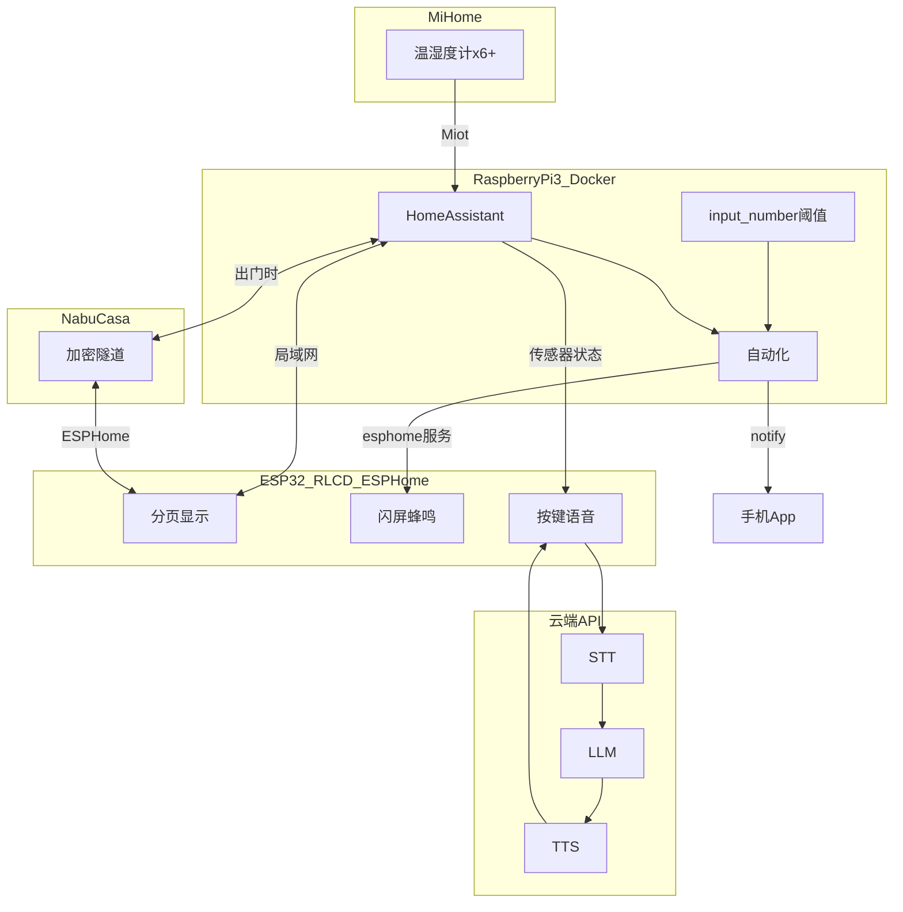

# 家用气候站：HA + Waveshare ESP32-S3-RLCD-4.2 — 设计规格

| 项目 | 内容 |
|------|------|
| 版本 | v1.0 |
| 日期 | 2026-05-22 |
| 状态 | 已定稿 |
| 硬件 | [Waveshare ESP32-S3-RLCD-4.2](../hardware-esp32s3-rlcd.md) |
| 中枢 | 树莓派 3（现有 Raspberry Pi OS）+ Docker Home Assistant |

---

## 1. 目标与范围

### 1.1 要做什么

- 将 **6 个以上** 小米温湿度计接入 **Home Assistant**（当前仅在米家 App）。
- 用 **RLCD 板子** 常显各房间温湿度、室外天气对比、当日最高温摘要。
- **可配置告警温度**（非写死 30°C）：超阈 → 手机推送 + 板子闪屏与蜂鸣。
- **按住 KEY 语音**：录音 → 云端 STT → LLM → TTS 朗读；可询问家中温湿度（上下文来自 HA）。
- **偶尔带板子出门**：通过 **Nabu Casa** 安全连接家里 HA；**不做内网穿透**。

### 1.2 本期不做

- 小米摄像头接入与屏上视频。
- 板子上离线大模型 / 完整离线中文 STT。
- 公网暴露 HA 端口（frp、端口映射等）。

---

## 2. 架构



### 2.1 职责划分

| 组件 | 职责 |
|------|------|
| **Home Assistant** | 小米接入、历史、日最高、天气对比、可配置阈值、自动化、手机推送、Nabu Casa |
| **ESPHome 板子** | 显示、本地强告警、语音 I/O、云端 STT/LLM/TTS |
| **Nabu Casa** | 出门时 ESP↔HA 加密连接，替代内网穿透 |
| **米家** | 仅作设备源，板子不直连 |

### 2.2 网络假设

| 场景 | 连接 | 能力 |
|------|------|------|
| 板子与 HA 同在家用 WiFi | 局域网 `api` | 全功能 |
| 板子出门连其他 WiFi | Nabu Casa 远程 API | 全功能（需已订阅并配置） |
| 无 Nabu Casa 且出门 | 无法连 HA | 降级：仅板载 SHTC3 + 提示未连接；家里告警仍靠手机 App |

---

## 3. Home Assistant 设计

### 3.1 安装方式

- **方案**：在现有 **Raspberry Pi OS** 上使用 **Docker Compose** 运行 HA Core（保留 Pi 上其他用途）。
- **不采用**：为 HA 单独重刷整盘（除非用户日后自愿）。

### 3.2 集成与实体

| 步骤 | 内容 |
|------|------|
| HACS | 安装后添加 **Xiaomi Miot Auto** |
| 设备 | 登录小米账号，导入全部温湿度计 |
| 命名 | 建议 `sensor.<房间>_temperature` / `_humidity` |
| 天气 | **和风天气**（或同类）用于室外温度对比 |
| 手机 | Home Assistant App + `notify.mobile_app_*` |

### 3.3 可配置告警温度

```yaml
# 辅助元素 — 在 HA UI 可拖动修改
input_number:
  climate_alert_threshold:
    name: 高温告警温度
    min: 20
    max: 40
    step: 0.5
    unit_of_measurement: "°C"
    initial: 30
```

自动化触发条件示例：

```yaml
above: "{{ states('input_number.climate_alert_threshold') | float }}"
```

- **防抖**：`for: 00:02:00`（超阈持续 2 分钟）。
- **可选**：`input_boolean.climate_alert_night_mute` 控制夜间仅推送不响。

### 3.4 统计与对比（HA 侧计算）

| 传感器类型 | 示例实体 |
|------------|----------|
| 当日最高温（每房间） | `sensor.<房间>_temp_max_today`（`statistics` / 模板） |
| 与室外差值 | `sensor.<房间>_delta_outdoor` |
| 全屋最热 | `sensor.climate_hottest_room`（模板） |

ESP **只订阅**上述实体当前值，不在板内算历史。

### 3.5 告警自动化

触发：`numeric_state`，所有房间 `temperature` 实体，`above` 使用 `input_number.climate_alert_threshold`。

动作（并行）：

1. `notify.mobile_app_<手机>` — 标题/正文含房间名与温度。
2. `esphome.climate_station_local_alarm` — `room`、`temp` 参数。

### 3.6 Nabu Casa

- 用户订阅 **Home Assistant Cloud（Nabu Casa）**。
- HA 启用远程访问；ESPHome 设备在编译配置中启用与 HA 的 cloud 连接（按 Nabu Casa 向导）。
- **禁止**将 `8123` 端口映射到公网作为替代方案。

---

## 4. ESPHome 板子设计

### 4.1 硬件引用

引脚与驱动见 [hardware-esp32s3-rlcd.md](../hardware-esp32s3-rlcd.md)：ST7305 SPI（12/11/5/40/41）、I2S 音频 `S3_RLCD_4_2`、KEY=GPIO18、BOOT=GPIO0、PA=GPIO46。

### 4.2 显示 UI（400×300 黑白）

| 页 | 内容 |
|----|------|
| 0 摘要 | 时间、最热房间、是否告警、室外温、差值、今日最高、当前告警阈值 |
| 1～N 列表 | 每页 3 间房：名称、温度、湿度、Δ室外 |

- 刷新：常态 60s；告警 2s 闪屏。
- KEY 短按翻页；BOOT 短按回摘要。

### 4.3 本地告警服务

`esphome.climate_station_local_alarm`：

1. `switch` 打开 GPIO46 功放。
2. `script`：30s 内屏幕反相闪烁 + `rtttl` 提示音。
3. 屏显：`高温! <房间> <温度>°C`。
4. KEY 可打断。

### 4.4 语音（阶段 P4）

| 步骤 | 实现 |
|------|------|
| 触发 | 按住 GPIO18 录音，松开处理 |
| STT | 讯飞 / 阿里 / Whisper API（`secrets.yaml`） |
| LLM | DeepSeek / 通义等；system prompt 注入 HA 传感器拼接文本 |
| TTS | 讯飞 / Edge TTS 等 → `speaker` 播放 |
| 失败 | 屏显错误文案，不崩溃 |

MVP 不做唤醒词；二期可选 `micro_wake_word`。

### 4.5 HA 实体订阅

通过 `homeassistant` 平台订阅：

- 各房间 `temperature` / `humidity`
- `input_number.climate_alert_threshold`
- 模板：`temp_max_today`、`delta_outdoor`、`weather` 室外温

实体 ID 列表放在 `firmware/esphome/entities.yaml`（用户接入小米后填写一次）。

---

## 5. 自动化安装包（仓库交付物）

实施阶段在仓库生成，用户以**少量命令**完成，避免逐步口述。

```
硬件-cursor/
├── docs/superpowers/specs/2026-05-22-ha-climate-station-design.md  # 本文
├── docs/project-ha-climate-station.md          # 用户操作指南（一条命令一步）
├── homeassistant/
│   ├── docker-compose.yml                    # HA + 可选 mosquitto
│   ├── .env.example
│   └── packages/
│       ├── climate_helpers.yaml                # input_number 等
│       ├── climate_sensors.yaml              # 模板传感器占位
│       └── climate_automations.yaml            # 告警 + notify + esphome
├── firmware/esphome/
│   ├── climate-station.yaml                  # 主配置
│   ├── entities.yaml.example                 # 6+ 实体 ID 模板
│   └── secrets.yaml.example
└── scripts/
    ├── setup-ha.sh                           # Pi 上一条命令装 HA
    ├── deploy-ha-packages.sh                 # 复制 packages 到 HA config
    └── flash-esp.sh                          # 本机 esphome run（需 USB）
```

### 5.1 用户仍需手动的部分（无法脚本化）

| 操作 | 原因 |
|------|------|
| 浏览器打开 HA 完成首次创建账号 | 安全 |
| 小米账号 OAuth / 登录 Miot | 厂商授权 |
| 订阅 Nabu Casa | 付费与账号 |
| 填写 `secrets.yaml`（WiFi、API Key） | 密钥不入库 |
| USB 连接板子第一次烧录 | 物理连接 |
| 把小米实体 ID 填入 `entities.yaml` | 依实际房间名而定 |

其余尽量脚本化。

---

## 6. 分期与验收

| 期 | 交付 | 验收 |
|----|------|------|
| **P1** | `setup-ha.sh` + Miot + 实体可见 | HA 中 6+ 路温湿度有历史 |
| **P2** | packages 统计与可配置告警 + 手机推送 | 改 `input_number` 后告警生效 |
| **P3** | ESPHome 显示 + `local_alarm` | 超阈闪屏响 |
| **P4** | 语音链路 | 按住 KEY 对话成功 |
| **P5** | Nabu Casa 远程 | 出门连热点仍能显示家里数据 |

---

## 7. 风险

| 风险 | 缓解 |
|------|------|
| Pi3 性能紧张 | 不跑摄像头转码；精简插件 |
| 小米 token 失效 | 关注 Miot 更新；保留米家 App |
| Nabu Casa 费用 | 用户已接受；出门才依赖 |
| API 密钥泄露 | `secrets.yaml` + `.gitignore` |
| 出门未开 Nabu Casa | 降级模式 + 手机 App |

---

## 8. 修订记录

| 版本 | 日期 | 说明 |
|------|------|------|
| v1.0 | 2026-05-22 | 定稿：可配置阈值、Nabu Casa、Docker HA、自动化安装包、排除摄像头 |
