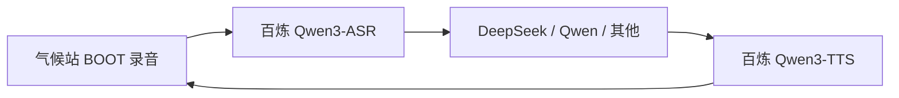

# 语音助手：百炼 STT/TTS + 自选 LLM

板子 **BOOT 按住说话** → HA 语音流水线 → 扬声器播放。

**不翻墙**：听写、朗读走阿里云百炼；对话大脑可单独选 DeepSeek、Qwen 等。

## 架构

| 环节 | 推荐 | 说明 |
|------|------|------|
| 录音 | 气候站 ESP32 | 已配置 |
| **STT 听** | **Aliyun BaiLian STT** | `qwen3-asr-flash`，与 TTS 同 Key |
| **TTS 说** | **Aliyun BaiLian TTS** | `qwen3-tts-flash` + 音色 `Cherry` |
| **LLM 想** | **OpenAI 兼容集成**（任选） | 与 STT/TTS **独立配置** |



---

## 0. 安装组件（Pi 上）

```bash
bash scripts/install-voice-components.sh church@192.168.31.155
```

会安装 **TTS**（上游 itning 仓库）和 **STT**（本仓库 `homeassistant/custom_components/aliyun_bailian_stt`）。

重启 HA 后再添加集成。

---

## 1. 百炼 API Key（STT + TTS 共用）

1. 打开 [百炼 API Key](https://bailian.console.aliyun.com/?tab=model#/api-key)
2. 复制 Key（`sk-...`）
3. **不需要翻墙**，国内阿里云账号即可，有免费额度

---

## 2. 添加 STT（语音转文字）

**设置 → 设备与服务 → 添加集成 → Aliyun BaiLian STT**

| 字段 | 建议值 |
|------|--------|
| 名称 | `百炼-STT` |
| Token | 百炼 API Key |
| Model | `qwen3-asr-flash` |
| enable_itn | 关（家用口语可保持 false） |

---

## 3. 添加 TTS（文字转语音）

**添加集成 → Aliyun BaiLian TTS**

| 字段 | 建议值 |
|------|--------|
| 名称 | `百炼-TTS` |
| Token | **同上** Key |
| Model | `qwen3-tts-flash` |
| Voice | `Cherry` |

---

## 4. 添加 LLM（对话大脑，任选其一）

通过 HA 官方 **OpenAI 对话** 集成，填不同 Base URL 即可换模型。

### 方案 A：DeepSeek（推荐，便宜）

| 字段 | 值 |
|------|-----|
| API Key | DeepSeek Key |
| Base URL | `https://api.deepseek.com/v1` |
| 模型 | `deepseek-chat`（勿填 `deepseek-v4-flash`，DeepSeek 官方 API 不支持，会导致助手测试出现 `[object Object]` / 语音失败） |

### 方案 B：ZenMux + Claude Sonnet 4.6

气候站当前使用 HA 自定义集成 **AI Conversation**（`custom_components/ai_conversation`），走 **OpenAI Chat Completions**（`/v1/chat/completions`）。

| 字段 | 值 |
|------|-----|
| API Key | [ZenMux](https://zenmux.ai) API Key（`sk-ss-v1-...` 或 `sk-ai-v1-...`） |
| Base URL | **`https://zenmux.ai/api/v1`**（OpenAI 兼容） |
| 模型 | **`anthropic/claude-sonnet-4.6`** |

> **关于 `https://zenmux.ai/api/anthropic`**：这是 Anthropic Messages 协议（`/v1/messages`），与 AI Conversation 的 Chat Completions **不兼容**。要用 Sonnet 4.6，请用上表 OpenAI 兼容端点；模型仍是同一个 Claude Sonnet 4.6。  
> 若坚持用 Anthropic 端点，需改用 HA 官方 **Anthropic** 集成（仅支持 Anthropic 官方 API，不能直接填 ZenMux 网关）。

**HA 里改模型（约 1 分钟）：**

1. **设置 → 设备与服务 → AI Conversation**（当前可能显示 `api.deepseek.com`）
2. 点 **配置** → 修改 **Base URL** 为 `https://zenmux.ai/api/v1`，**API Key** 换成 ZenMux Key
3. 进入子项 **Agent** → **模型** 填 `anthropic/claude-sonnet-4.6`（Instructions / Prompt 可保留原中文对话模板）
4. **控制 Home Assistant** 建议关闭（纯聊天，避免 524 超时）
5. **设置 → 语音助手 → bailian** → 对话代理仍选该 Agent；**设置 → ESPHome → 气候站** Voice Assistant 仍为 `bailian`
6. 助手测试或按住 BOOT 说一句话验证

**联网搜索：** Base URL 含 `zenmux.ai` 时自动启用。**Claude 模型**（`anthropic/*`）走 ZenMux [Anthropic Messages + web_search 工具](https://docs.zenmux.ai/zh/guide/advanced/web-search)；OpenAI 兼容模型走 `web_search_options`。Chat Completions 上的 `web_search_options` **对 Claude Sonnet 无效**，这是 ZenMux/模型限制，不是 HA 缺陷。

### 方案 C：百炼 Qwen

| 字段 | 值 |
|------|-----|
| API Key | 百炼 Key（可与 STT/TTS 相同） |
| Base URL | `https://dashscope.aliyuncs.com/compatible-mode/v1` |
| 模型 | `qwen-plus` 或 `qwen-turbo` |

### 方案 C：其他 OpenAI 兼容服务

Moonshot、智谱、本地 Ollama 等，只要 HA OpenAI 集成支持即可。

> LLM 与 STT/TTS **完全解耦**：换 DeepSeek 不影响百炼语音。

---

## 5. 创建语音助手 `pi-voice`

**设置 → 语音助手 → 添加助手**：

| 字段 | 选择 |
|------|------|
| 名称 | `pi-voice` |
| 语言 | 中文 |
| 对话代理 | **OpenAI 对话**（上面配置的 DeepSeek / Qwen 等） |
| 语音转文字 | **Aliyun BaiLian STT** |
| 文字转语音 | **Aliyun BaiLian TTS** |

---

## 6. 绑定气候站

**设置 → 设备与服务 → ESPHome → 气候站** → Voice Assistant → 选 **pi-voice**。

---

## 7. 测试

1. **按住 BOOT**，说：「西雷丽现在多少度」
2. **松开 BOOT**
3. 等 DeepSeek/Qwen 回答，百炼 TTS 朗读

屏幕会进入全屏 **语音交互** overlay，四步进度：**听 → 识别 → 思考 → 播报**，对应状态词「正在听 / 识别中 / 思考中 / 播报中」。失败时显示「语音失败」，约 3 秒后恢复温湿度主界面。

---

## 常见问题

| 现象 | 处理 |
|------|------|
| STT 下拉为空 | 确认已装 STT 组件并重启 HA；添加 Aliyun BaiLian STT 集成 |
| 识别不准 | 在 STT 选项里确认 model 为 `qwen3-asr-flash`；说话清晰、靠近麦克风 |
| 能听不说 | 检查 TTS 集成与 `qwen3-tts-flash` 模型 |
| LLM 无回复 / 助手测试显示 `[object Object]` | AI Conversation 里模型名必须是 `deepseek-chat`；`deepseek-v4-flash` 会报 API 400 |
| 想换 LLM | 只改 OpenAI 集成或助手里的对话代理，STT/TTS 不用动 |

---

## 旧方案（需翻墙，不推荐）

Google Cloud STT 见已废弃文档 `voice-assistant-setup-qwen-google.md`（仅作参考）。
